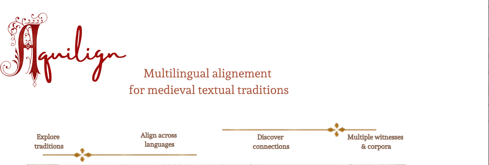

# AQUILIGN – Multilingual Aligner for Historical Corpora

<p align="center">
  
</p>

[](https://codecov.io/github/ProMeText/Aquilign)
[](https://ceur-ws.org/Vol-3834/paper104.pdf)
[](https://doi.org/10.63317/32HUZUUOKPFR)
[](https://doi.org/10.5281/zenodo.16992629)
[](https://huggingface.co/ProMeText/aquilign-multilingual-segmenter)


 *How can we computationally align medieval texts written in different languages and copied over centuries — without losing their philological depth?*

**AQUILIGN** is a multilingual alignment and collation engine designed for **historical corpora**.  
It performs **phrase-level alignment** of parallel texts using a combination of **regular-expression-based and BERT-based segmentation**, and supports multilingual workflows across medieval Romance, Latin, and Middle English texts.

Developed by the **ProMeTEXT** team.
---

##  Key Features

-  **Multilingual clause-level alignment** using contextual embeddings  
-  **Trainable segmentation module** (BERT-based or regex-based)  
-  Optimized for **premodern and historical corpora**

AQUILIGN builds on a fork of [Bertalign](https://github.com/bfsujason/bertalign), customized for historical languages and alignment evaluation.

---

## Installation

> **Caveat**: AQUILIGN is currently tested on **Python 3.9 and 3.10**.  
> Compatibility with other Python versions is not guaranteed.  
> Some dependencies, including `sentence-transformers`, are version-sensitive; please install the versions listed in [`requirements.txt`](https://github.com/ProMeText/Aquilign/blob/main/requirements.txt).

```bash
git clone https://github.com/ProMeText/Aquilign.git
cd Aquilign
pip install -r requirements.txt
```


## Training the Segmenter

The segmenter is based on a trainable `BertForTokenClassification` model from Hugging Face’s `transformers` library.

We fine-tune this model to detect custom sentence delimiters (`£`) in historical texts from the **[Multilingual Segmentation Dataset](https://github.com/ProMeText/multilingual-segmentation-dataset)**.

A trained multilingual segmenter model is also available on Hugging Face:

[**aquilign-multilingual-segmenter**](https://huggingface.co/ProMeText/aquilign-multilingual-segmenter)

---

### 🔧 Example Command

```bash
python3 train_tokenizer.py \
  -m google-bert/bert-base-multilingual-cased \
  -t multilingual-segmentation-dataset/data/Multilingual_Aegidius/segmented/split/multilingual/train.json \
  -d multilingual-segmentation-dataset/data/Multilingual_Aegidius/segmented/split/multilingual/dev.json \
  -e multilingual-segmentation-dataset/data/Multilingual_Aegidius/segmented/split/multilingual/test.json \
  -ep 100 \
  -b 128 \
  --device cuda:0 \
  -bf16 \
  -n multilingual_model \
  -s 2 \
  -es 10
```
This command fine-tunes the `bert-base-multilingual-cased` model with the following configuration:

- **Epochs**: `100`  
- **Batch size**: `128`  
- **Device**: `cuda:0` (GPU)  
- **Precision**: `bf16` (bfloat16 mixed precision)  
- **Checkpointing**: Saves the model every 2 epochs  
- **Early stopping**: Stops after 10 epochs without improvement

---

### Input Format: JSON Schema

Training data must follow a structured JSON format, including both metadata and examples.

```json
{
  "metadata": {
    "lang": ["la", "it", "es", "fr", "en", "ca", "pt"],
    "centuries": [13, 14, 15, 16],
    "delimiter": "£"
  },
  "examples": [
    {
      "example": "que mi padre me diese £por muger a un su fijo del Rey",
      "lang": "es"
    },
    {
      "example": "Per fé, disse Lion, £i v’andasse volentieri, £ma i vo veggio £qui",
      "lang": "it"
    }
  ]
}
```
- The `metadata` block must include:

  - `"lang"`: a list of ISO 639-1 codes representing the languages in the dataset  
  - `"centuries"`: historical coverage of the examples (used for metadata and possible filtering)  
  - `"delimiter"`: the segmentation marker token (default: `£`), predicted by the model

- The `examples` block is an array of training samples, each containing:

  - `"example"`: a string of text including segmentation markers  
  - `"lang"`: the ISO code of the language the text belongs to

---

📖 For more details, see the full documentation:  
➡️ [segmentation_model.md](https://github.com/carolisteia/multilingual-segmentation-dataset/blob/main/docs/segmentation_model.md)


## Using the Aligner

To align a set of parallel texts using the BERT-based segmenter, run:

```bash
python3 main.py \
  -o lancelot \
  -i data/extraitsLancelot/ii-48/ \
  -mw data/extraitsLancelot/ii-48/fr/micha-ii-48.txt \
  -d cuda:0 \
  -t bert-based
```
This will:

-  Align the multilingual files found in `data/extraitsLancelot/ii-48/`
-  Use the **Micha edition** (French) as the **base witness**
-  Run on the **GPU** (`cuda:0`)
-  Save results to: `result_dir/lancelot/`


>  Files must be sorted by language, using the ISO 639-1 language code  
> as the **parent directory name** (`es/`, `fr/`, `it/`, `en/`, etc.).

To view all available options:

```bash
python3 main.py --help
```

---
## Related Projects

**Aquilign** is part of the broader **ProMeTEXT** ecosystem of tools, applications, models, and corpora for the computational study of medieval multilingual textual traditions.

The following resources provide datasets, interfaces, models, and companion corpora related to Aquilign.

- [Multilingual Segmentation Dataset](https://github.com/ProMeText/multilingual-segmentation-dataset)  
  Sentence- and clause-level segmentation datasets in seven medieval languages, used to train and evaluate the segmentation model integrated into Aquilign.

- [Aquilign Multilingual Segmenter](https://huggingface.co/ProMeText/aquilign-multilingual-segmenter)  
  A trained multilingual segmentation model hosted on Hugging Face, used to detect custom sentence delimiters in historical texts.

- [Aquilign Explorer](https://huggingface.co/spaces/ProMeText/aquilign-explorer)  
  A demo app hosted on Hugging Face Spaces for testing and demonstrating Aquilign’s multilingual medieval text alignment workflows.

- [Corpus Temporis App](https://github.com/ProMeText/CorpusTemporis)  
  A Streamlit-based application for managing and structuring metadata of medieval multilingual texts.  
  It provides metadata that can accompany aligned corpora and support their use in the [Aquilign multilingual aligner](https://github.com/ProMeText/Aquilign).

- [Parallelium – an aligned scriptures dataset](https://github.com/ProMeText/parallelium-scriptures-alignment-dataset)  
  A multilingual dataset of aligned Biblical and Qur’anic texts, medieval and modern, used for benchmarking multilingual alignment in diverse historical settings.

- [Lancelot par maints langages](https://github.com/ProMeText/lancelot-par-maints-langages)  
  A parallel corpus of *Lancelot en prose* in French, Castilian, and Italian, first tested for Aquilign’s multilingual alignment and stemmatological comparison.

- [Multilingual Aegidius](https://github.com/ProMeText/Multilingual_Aegidius)  
  A corpus of *De regimine principum* and its translations in Latin, Romance vernaculars, and Middle English, built using the Aquilign segmentation and alignment workflow.

---

##  Project Status & Future Directions

**Aquilign** is under active development and currently supports:

-  Sentence- and clause-level alignment across multiple languages  
-  Integration with BERT-based and regex-based segmenters  
-  Alignment evaluation and output export in tabular format  
-  Compatibility with multilingual historical corpora (e.g. *Lancelot*, *De Regimine Principum*)

---

###  Planned Features

-  **Collation Module**:  
  Automatic generation of collation tables across aligned witnesses for textual variant analysis

-  **Stemmatic Analysis Integration**:  
  Tools for stemmatological inference based on alignment structure and textual divergence

-  **Interactive Visualization Tools**:  
  Visualization of alignment, variant graphs, and stemma hypotheses

-  **Support for Additional Languages**:  
  Extending tokenization and alignment capabilities to new premodern languages and scripts


---

##  Contact & Contributions

We welcome questions, feedback, and contributions to improve the Aquilign pipeline.

-  Found a bug or have a feature request?  
  ➡️ [Open an issue](https://github.com/ProMeText/Aquilign/issues)

-  Want to contribute code or improvements?  
  ➡️ Fork the repo and submit a pull request

-  For academic collaboration or project inquiries:  
  ➡️ Reach out via [GitHub Discussions](https://github.com/ProMeText/Aquilign/discussions) or contact the authors directly

---
##  Citation

If you use this tool in your research, please cite:

Gille Levenson, M., Ing, L., & Camps, J.-B. (2024).  
**Textual Transmission without Borders: Multiple Multilingual Alignment and Stemmatology of the _Lancelot en prose_ (Medieval French, Castilian, Italian).**  
In W. Haverals, M. Koolen, & L. Thompson (Eds.), *Proceedings of the Computational Humanities Research Conference 2024* (Vol. 3834, pp. 65–92). CEUR.  
🔗 [https://ceur-ws.org/Vol-3834/#paper104](https://ceur-ws.org/Vol-3834/#paper104)

### 📄 BibTeX

```bibtex
@inproceedings{gillelevenson_TextualTransmissionBorders_2024a,
  title = {Textual Transmission without Borders: Multiple Multilingual Alignment and Stemmatology of the ``Lancelot En Prose'' (Medieval French, Castilian, Italian)},
  shorttitle = {Textual Transmission without Borders},
  booktitle = {Proceedings of the Computational Humanities Research Conference 2024},
  author = {Gille Levenson, Matthias and Ing, Lucence and Camps, Jean-Baptiste},
  editor = {Haverals, Wouter and Koolen, Marijn and Thompson, Laure},
  date = {2024},
  series = {CEUR Workshop Proceedings},
  volume = {3834},
  pages = {65--92},
  publisher = {CEUR},
  location = {Aarhus, Denmark},
  issn = {1613-0073},
  url = {https://ceur-ws.org/Vol-3834/#paper104},
  urldate = {2024-12-09},
  eventtitle = {Computational Humanities Research 2024},
  langid = {english}
}
```
--- 
##  Funding and computing infrastructures

This work benefited from national funding managed by the **Agence Nationale de la Recherche**  
under the *Investissements d'avenir* programme with the reference:  
**ANR-21-ESRE-0005 (Biblissima+)**

> Ce travail a bénéficié d'une aide de l’État gérée par l’**Agence Nationale de la Recherche**  
> au titre du programme d’**Investissements d’avenir**, référence **ANR-21-ESRE-0005 (Biblissima+)**.

<p align="center">
  
</p>

It has benefited from the CBP (Centre Blaise Pascal) computing infrastructure, hosted at the École Normale Supérieure de Lyon.  
<p align="center">

</p>

> Ce projet a également bénéficié des infrastructures de calcul du Centre Blaise Pascal, hébergé à l'École 
> Normale Supérieure de Lyon.

##  License

This project is released under the **[GNU General Public License v3.0](./LICENCE)**.  
You are free to use, modify, and redistribute the code under the same license conditions.
